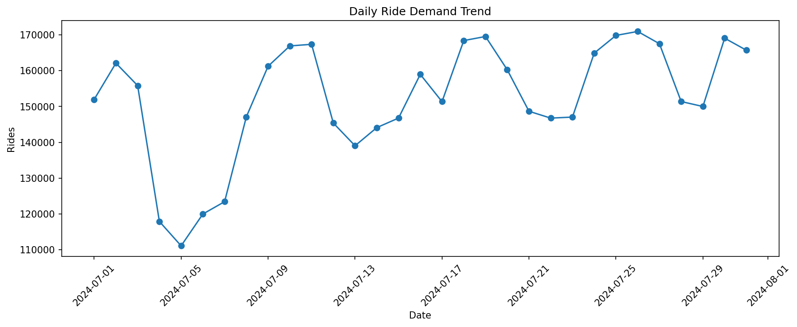
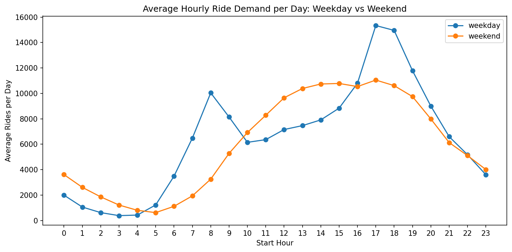
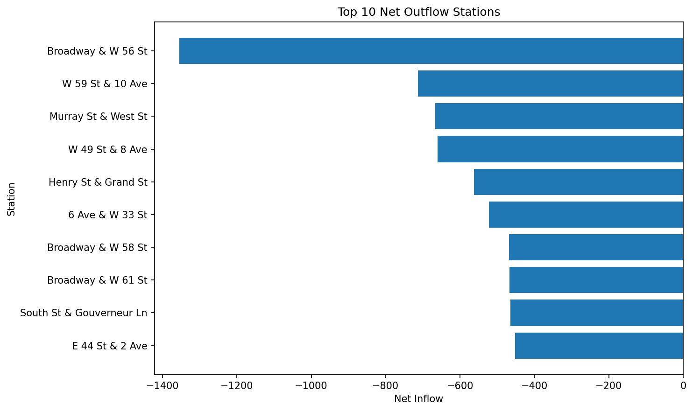
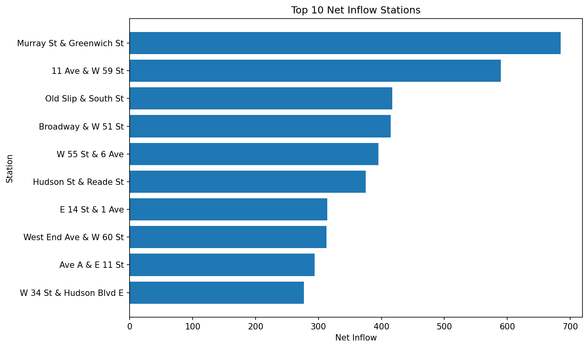
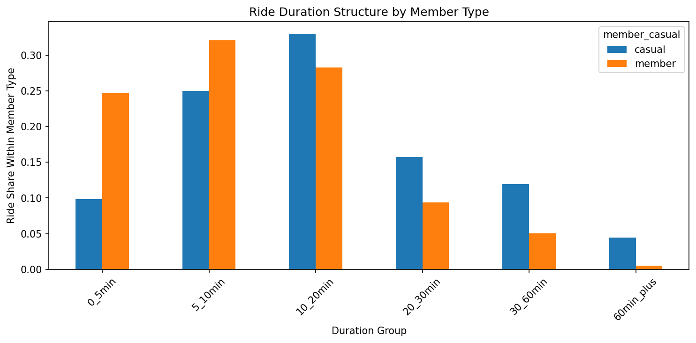
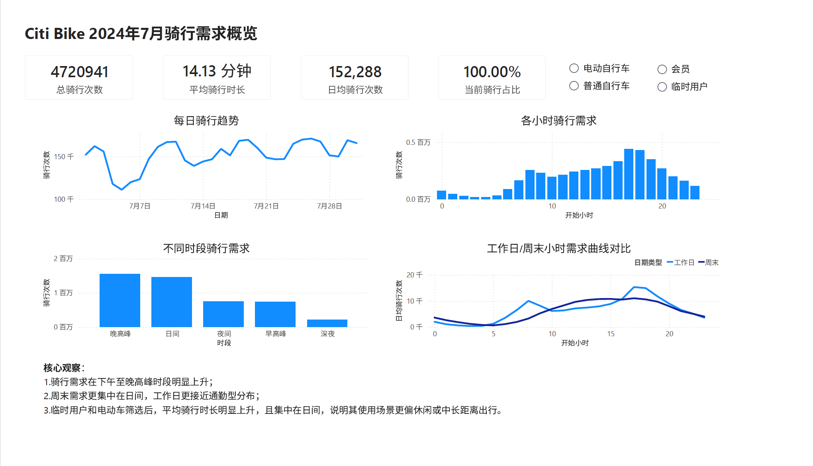
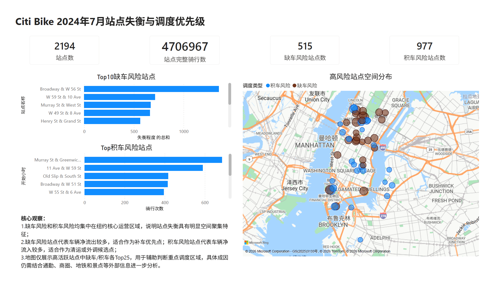
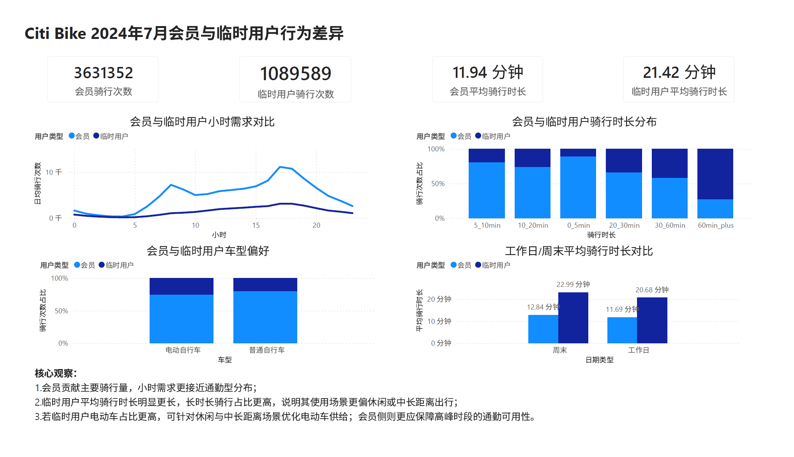

# Citi Bike共享单车运营分析：需求高峰、站点失衡与用户行为洞察

## 项目概览

本项目围绕“共享单车在高峰时段是否存在明显站点调度压力”展开，基于Citi Bike 2024年7月公开骑行数据构建骑行事件级宽表，并进一步完成需求规律、站点净流入净流出、晚高峰调度压力、会员与临时用户行为差异和运营建议分析。

| 核心指标 | 结果 |
|---|---:|
| 有效骑行订单数 | 4,720,941 |
| 日均骑行量 | 152,288 |
| 单日最高骑行量 | 170,957 |
| 需求最高小时 | 17:00 |
| 会员订单占比 | 76.92% |
| 临时用户订单占比 | 23.08% |
| 站点失衡分析订单数 | 4,706,967 |
| 全日最大净流出站点 | Broadway & W 56 St（-1,354） |
| 晚高峰最大净流出站点 | E 47 St & Park Ave（-2,790） |

## 项目交付物

| 交付物 | 路径 | 说明 |
|---|---|---|
| 项目说明与结论 | README.md | 展示项目背景、分析流程、核心发现、业务建议和运行方式 |
| Python分析过程 | notebooks/ | 包含数据理解、宽表构建、需求分析、站点失衡分析、用户差异分析和BI数据导出 |
| SQL复现脚本 | sql/ | 使用MySQL 8.0复现核心业务指标查询 |
| 核心图表 | outputs/figures/ | README中展示的关键图表和Power BI看板截图 |
| BI分析数据表 | outputs/bi/ | 面向Power BI的明细表和聚合表 |
| Power BI看板 | outputs/PowerBI/citibike_dashboard.pbix | 基于BI数据表制作的可视化看板 |

## 1.项目背景

Citi Bike是纽约城市共享单车系统，公开数据集中包含每次骑行的起止时间、起终点站、经纬度、车型和用户类型。与电商订单数据不同，共享单车数据更强调时间分布、空间流动和运营调度问题，适合展示出行运营分析、站点供需识别和BI看板设计能力。

本项目不将分析重点放在用户留存或会员转化漏斗，因为数据集中不包含用户ID、曝光、注册、付费转化等用户级行为数据。因此，本项目聚焦于骑行事件和站点运营，围绕需求高峰、站点失衡、会员与临时用户行为差异进行分析。

本项目的核心问题是：共享单车需求在什么时间集中？哪些站点在全日或晚高峰存在缺车或积车风险？会员和临时用户的使用行为是否存在明显差异？这些发现如何转化为调度和运营建议？

## 2.业务问题

本项目主要回答以下问题：

1.7月整体骑行需求规模如何？日度需求是否存在明显波动？

2.不同小时、工作日和周末的骑行需求有什么差异？

3.哪些站点持续净流出，可能出现缺车风险？

4.哪些站点持续净流入，可能出现积车风险？

5.晚高峰站点失衡是否比全日平均更突出？

6.会员和临时用户在骑行时长、使用时段和车型偏好上有什么差异？

7.运营侧可以如何安排补车、清运、供给配置和用户分层策略？

## 3.数据说明

数据来源：Citi Bike System Data，2024年7月骑行数据。

本项目主要使用原始骑行明细数据，核心字段包括：

| 字段 | 主要作用 |
|---|---|
| ride_id | 骑行记录ID，用于检查记录唯一性 |
| rideable_type | 车型，包括classic_bike和electric_bike |
| started_at | 骑行开始时间，用于构建日期、小时、星期和时段字段 |
| ended_at | 骑行结束时间，用于计算骑行时长 |
| start_station_name | 起点站名称，用于站点出发需求和净流出分析 |
| end_station_name | 终点站名称，用于站点到达需求和净流入分析 |
| start_lat / start_lng | 起点经纬度，用于地图和站点位置展示 |
| end_lat / end_lng | 终点经纬度，用于地图和站点位置展示 |
| member_casual | 用户类型，用于对比会员和临时用户行为差异 |

由于原始数据是一行一次骑行事件，本项目先进行时间范围、骑行时长、缺失值和站点字段检查，再构建骑行事件级分析宽表trip_base，作为后续需求分析、站点失衡分析和Power BI看板的数据基础。

### 样本口径说明

本项目根据不同分析目标使用不同样本口径：

需求规律分析使用自然月内开始、骑行时长大于0且不超过24小时的有效骑行订单，主要用于统计日度需求、小时需求、工作日/周末差异和时段结构。

站点失衡分析使用起点站和终点站字段完整的骑行订单，主要用于计算各站点start_rides、end_rides、net_inflow和imbalance_type。

会员与临时用户分析使用有效骑行订单，主要用于对比member和casual在骑行时长、使用时段和车型偏好上的差异。

因此，不同章节中的订单数可能略有差异，这是由分析目标和字段完整性要求不同造成的。

## 4.分析流程

### 4.1数据理解与基础检查

在01_data_overview.ipynb中，首先读取Citi Bike 2024年7月原始数据，检查字段类型、行列数、时间范围、缺失值、车型分布、用户类型分布和站点字段完整性。

主要结论：

原始数据以ride_id作为骑行记录ID，整体粒度为一行一次骑行。

数据中存在少量跨月记录，因此后续主分析口径筛选自然月内开始的骑行。

部分记录缺少起点站或终点站信息，因此站点失衡分析需要单独使用站点字段完整样本。

### 4.2构建骑行事件级宽表

在02_build_trip_base.ipynb中，基于原始骑行明细构建trip_base宽表，保留一行一次骑行的粒度，并增加日期、小时、星期、时段、时长分组和样本标记字段。

主要构建字段包括：

| 字段 | 含义 |
|---|---|
| ride_duration_min | 骑行时长，单位为分钟 |
| start_date | 骑行开始日期 |
| start_month | 骑行开始月份 |
| start_hour | 骑行开始小时 |
| day_of_week | 星期名称 |
| day_of_week_num | 星期序号 |
| is_weekend | 是否周末 |
| time_period | 时段分组，包括late_night、morning_peak、daytime、evening_peak和night |
| duration_group | 骑行时长分组 |
| is_station_sample | 起点站和终点站字段是否完整 |
| is_map_sample | 起终点经纬度字段是否完整 |

清洗完成后，trip_base保持一行一次骑行事件，可作为后续需求、站点和用户差异分析的基础表。

### 4.3需求规律分析

在03_demand_pattern_analysis.ipynb中，基于有效骑行订单进行需求规律分析。

主要分析内容包括：

日度骑行量和平均骑行时长；

小时骑行量分布；

工作日和周末的需求差异；

不同小时下工作日与周末需求曲线对比；

不同用户类型在小时需求上的差异。

### 4.4站点失衡分析

在04_station_imbalance_analysis.ipynb中，基于站点字段完整样本计算站点净流入和净流出。

本项目使用以下口径衡量站点失衡：

```text
net_inflow = end_rides - start_rides
```

net_inflow为负表示该站点流出大于流入，可能存在缺车风险；net_inflow为正表示该站点流入大于流出，可能存在积车风险。

主要分析内容包括：

全日站点净流入和净流出；

Top净流出站点和Top净流入站点；

高活跃站点中的缺车风险和积车风险；

晚高峰站点失衡情况；

全日口径与晚高峰口径的调度压力差异。

### 4.5会员与临时用户行为差异分析

在05_member_casual_behavior_analysis.ipynb中，基于有效骑行订单对比会员和临时用户行为差异。

主要分析内容包括：

会员和临时用户订单规模与占比；

不同用户类型的平均骑行时长；

骑行时长分组结构；

工作日和周末差异；

小时和时段使用结构；

车型偏好差异。

### 4.6导出图表和BI数据表

在06_export_bi_data.ipynb中，基于trip_base、station_imbalance和evening_station_imbalance导出核心展示图表和Power BI分析数据表。

主要产出包括：

日度骑行需求趋势图；

工作日与周末小时需求曲线图；

Top10净流出站点图；

Top10净流入站点图；

会员与临时用户骑行时长结构图；

用于Power BI进一步分析的outputs/bi目录数据表。

Power BI看板文件位于outputs/PowerBI/citibike_dashboard.pbix。

## 5.核心发现

- **骑行需求明显集中在晚高峰**

7月有效骑行订单数为4,720,941，日均骑行量约152,288。单日最高骑行量出现在2024-07-26，达到170,957。

从小时分布看，17:00是全月需求最高的小时，订单量为441,147；18:00次之，订单量为428,892。说明晚高峰是共享单车运营中最需要关注的供给时段。

- **工作日与周末呈现不同需求结构**

工作日需求更接近通勤型结构，早高峰和晚高峰更明显；周末需求更集中在中午到下午，整体更偏休闲出行。

这意味着运营侧不能只用统一的日均需求安排车辆供给，而应区分工作日通勤场景和周末休闲场景。

- **全日口径下存在明显站点净流出和净流入**

在全日站点失衡口径下，Broadway & W 56 St净流出最高，net_inflow为-1,354；W 59 St & 10 Ave、Murray St & West St、W 49 St & 8 Ave等站点也存在较高净流出。

净流出站点可能在高需求时段出现缺车风险，需要结合调度车辆和周边站点供给进行补车安排。

- **晚高峰站点失衡比全日平均更集中**

晚高峰口径下，E 47 St & Park Ave净流出达到-2,790，North Moore St & Greenwich St、1 Ave & E 68 St等站点也存在明显净流出。

这说明仅看全日平均可能低估高峰期调度压力。对共享单车运营而言，晚高峰应单独建立优先级，而不是完全依赖全日净流入净流出口径。

- **会员和临时用户呈现不同使用场景**

会员订单数为3,631,352，占比约76.92%，是主要使用群体。临时用户订单数为1,089,589，占比约23.08%。

从骑行时长看，会员平均骑行时长更短，更偏通勤和稳定使用；临时用户平均骑行时长更长，更偏休闲和游客场景。临时用户中电单车订单占比较高，说明电单车可能更适合面向休闲和非通勤场景进行供给配置。

## 6.核心图表展示

### 6.1每日骑行需求趋势



### 6.2工作日与周末小时需求曲线



### 6.3Top10净流出站点



### 6.4Top10净流入站点



### 6.5会员与临时用户骑行时长结构



### 6.6Power BI需求总览页



### 6.7Power BI站点调度页



### 6.8Power BI用户行为页



## 7.业务建议

### 7.1建立晚高峰站点补车优先级

建议对晚高峰净流出较高的站点建立补车优先级，重点关注E 47 St & Park Ave、North Moore St & Greenwich St、1 Ave & E 68 St等站点。

这类站点在晚高峰出发需求明显高于到达需求，如果不提前补车，可能影响用户取车体验和高峰期订单转化。

### 7.2对净流入站点设置清运或容量预警

建议对Riverside Blvd & W 67 St、1 Ave & E 6 St、W 43 St & 10 Ave等晚高峰净流入站点设置积车预警。

这类站点可能出现车辆堆积或还车压力，需要结合站点容量、周边站点可用桩位和调度路线进行清运安排。

### 7.3区分通勤场景和休闲场景进行供给配置

工作日应重点保障早晚高峰通勤站点供给，周末则应加强中午到下午、热门休闲区域和游客区域的车辆配置。

对于临时用户占比较高、平均骑行时长较长的区域，可以考虑增加电单车供给，并结合游客场景设计短期权益或会员转化策略。

### 7.4在Power BI中保留多口径分析

建议Power BI看板同时保留全日口径和晚高峰口径，并将net_inflow、imbalance_type、total_activity和member_casual作为核心筛选字段。

全日口径适合观察长期供需结构，晚高峰口径适合制定调度动作。两者结合可以避免平均值掩盖高峰风险。

## 8.项目局限

1.本项目只分析2024年7月单月数据，无法覆盖完整季节性，也不能代表全年需求规律。

2.数据集中缺少天气、节假日、赛事活动和地铁施工等外部因素，因此无法解释所有日度波动。

3.数据集中缺少站点容量、实时库存和调度车辆成本，因此net_inflow只能作为缺车或积车风险的代理指标，不等同于真实库存状态。

4.数据集中不包含用户ID，因此不能进行用户留存、复购、生命周期或真实会员转化分析。

5.站点名称可能存在命名调整或站点变更，本项目第一版以站点名称作为站点分析主键，后续可进一步结合station_id和地理坐标做更严格的站点映射。

## 9.技术栈

Python

Pandas

NumPy

Matplotlib

Jupyter Notebook

MySQL 8.0

Markdown

Power BI

## 10.项目文件结构

```text
citibike-operation-analysis/
├── data_raw/
│   └── 202407-citibike-tripdata.zip
├── data_clean/
│   ├── trip_base_202407.csv
│   ├── station_imbalance_202407.csv
│   └── evening_station_imbalance_202407.csv
├── notebooks/
│   ├── 01_data_overview.ipynb
│   ├── 02_build_trip_base.ipynb
│   ├── 03_demand_pattern_analysis.ipynb
│   ├── 04_station_imbalance_analysis.ipynb
│   ├── 05_member_casual_behavior_analysis.ipynb
│   └── 06_export_bi_data.ipynb
├── sql/
│   ├── README.md
│   ├── 00_create_trip_base_table.sql
│   ├── 01_create_pk_and_indexes.sql
│   ├── 02_check_trip_base.sql
│   ├── 03__demand_pattern.sql
│   ├── 04__station_imbalance.sql
│   └── 05__member_casual_behavior.sql
├── outputs/
│   ├── bi/
│   │   ├── bi_trip_base_202407.csv
│   │   ├── bi_daily_demand_202407.csv
│   │   ├── bi_hourly_demand_202407.csv
│   │   ├── bi_time_period_member_202407.csv
│   │   ├── bi_bike_type_member_202407.csv
│   │   ├── bi_station_imbalance_202407.csv
│   │   └── bi_evening_station_imbalance_202407.csv
│   ├── PowerBI/
│   │   └── citibike_dashboard.pbix
│   └── figures/
│       ├── 01_daily_ride_demand_trend.png
│       ├── 02_hourly_pattern_by_day_type.png
│       ├── 03_top10_net_outflow_stations.png
│       ├── 04_top10_net_inflow_stations.png
│       ├── 05_duration_structure_by_member_type.png
│       ├── 06_bi_demand_overview.png
│       ├── 07_bi_station_rebalance.png
│       └── 08_bi_member_casual_behavior.png
├── README.md
└── requirements.txt
```

## 11.运行说明

1.从Citi Bike System Data下载2024年7月骑行数据。

2.将原始压缩包放入data_raw目录。

3.安装Python依赖：

```bash
pip install -r requirements.txt
```

4.按顺序运行notebooks目录下的文件：

```text
01_data_overview.ipynb
02_build_trip_base.ipynb
03_demand_pattern_analysis.ipynb
04_station_imbalance_analysis.ipynb
05_member_casual_behavior_analysis.ipynb
06_export_bi_data.ipynb
```

5.02_build_trip_base.ipynb会生成data_clean/trip_base_202407.csv，后续需求、站点和用户差异分析基于该骑行事件级宽表展开。

6.04_station_imbalance_analysis.ipynb会生成data_clean/station_imbalance_202407.csv和data_clean/evening_station_imbalance_202407.csv，用于站点失衡分析。

7.06_export_bi_data.ipynb会生成outputs/figures目录下的核心图表，以及outputs/bi目录下的Power BI分析数据表。

8.Power BI看板文件保存在outputs/PowerBI/citibike_dashboard.pbix。该文件使用outputs/bi目录下的数据表作为BI分析数据源。

## 12.SQL分析说明

sql目录用于复现核心业务指标查询，主要基于02_build_trip_base.ipynb生成的骑行事件级宽表trip_base展开。更详细的导入说明见sql/README.md。

当前SQL脚本采用MySQL 8.0语法，默认数据库名为citibike，表名为trip_base。运行前需要先执行sql/00_create_trip_base_table.sql创建数据库和表结构，再将data_clean/trip_base_202407.csv导入MySQL，并确保字段名与CSV表头一致。

建议执行顺序如下：

```text
00_create_trip_base_table.sql
01_create_pk_and_indexes.sql
02_check_trip_base.sql
03__demand_pattern.sql
04__station_imbalance.sql
05__member_casual_behavior.sql
```

各SQL文件与Notebook分析主题的对应关系如下：

| SQL文件 | 分析主题 |
|---|---|
| 00_create_trip_base_table.sql | 创建citibike数据库和trip_base表结构 |
| 01_create_pk_and_indexes.sql | 为ride_id、日期、小时、用户类型和站点字段创建主键与索引 |
| 02_check_trip_base.sql | 检查骑行宽表行数、唯一性、时间范围、用户类型、车型和样本标记 |
| 03__demand_pattern.sql | 分析日度、小时、工作日/周末和时段需求 |
| 04__station_imbalance.sql | 构建站点失衡视图，识别缺车和积车风险站点 |
| 05__member_casual_behavior.sql | 分析会员与临时用户在时长、时段、车型和站点上的差异 |

SQL部分主要用于展示关系型数据分析能力，与Notebook中的Python分析结果互相印证。更完整的图表展示、Power BI看板和业务解释仍以Notebook和README为准。
